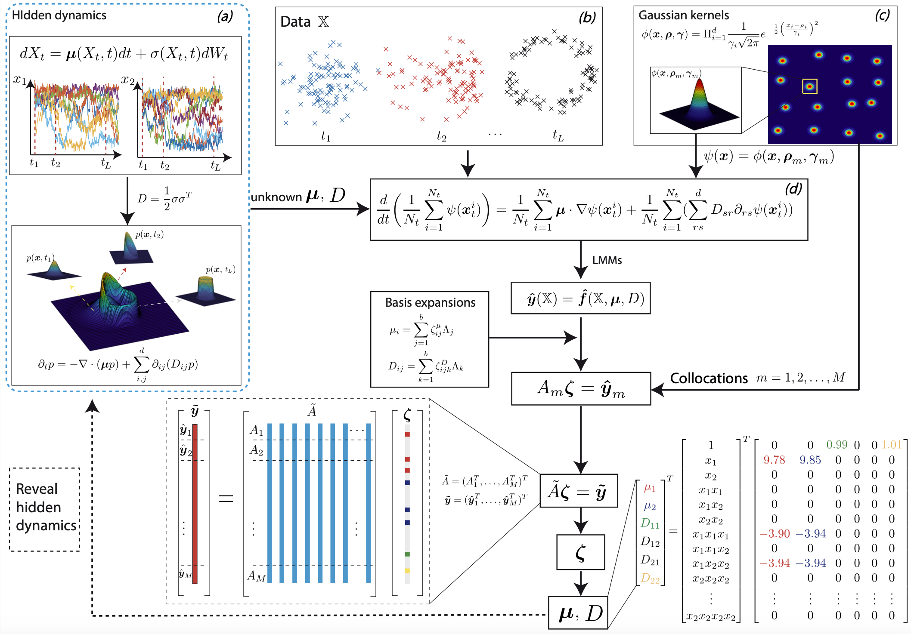

# Weak Collocation Regression method
Revealing hidden dynamics from the stochastic data is a challenging problem as the randomness takes part in the evolution of the data.  The problem becomes exceedingly hard if the trajectories of the stochastic data are absent in many scenarios. In this work, we propose the Weak Collocation Regression (WCR) method to learn the dynamics from the stochastic data without the labels of trajectories. This method utilize  the  governing equation of the probability distribution function--the Fokker-Planck (FP) equation. Using its weak form and integration by parts, we move all the spacial derivatives of the distribution function to the test functions which can be computed explicitly. Since the data is a sampling of the corresponding distribution function, we can compute the integrations in the weak form, which has no spacial derivatives on the distribution functions, by simply adding the values of the integrands 
at the data points. We further assume the unknown drift and diffusion terms can be expanded by the base functions in a dictionary with the coefficients to be determined. Cooperating  the collocation treatment and linear multi-step methods, we transfer the revealing process to a linear algebraic system. Using the sparse regression, we eventually obtain the unknown coefficients and hence the hidden stochastic dynamics. The numerical experiments show that our method is flexible and fast, which reveals the dynamics within seconds in the multi-dimensional problems and can be extended to high dimensional data. The complex tasks with variable-dependent diffusion and coupled drift can be correctly identified by WCR and the performance is robust, achieving high accuracy in the cases of noisy data. The rigorous error estimate is also included to support our various numerical experiments.

For more information, please refer to the [paper](https://arxiv.org/abs/2209.02628).



***

# Data acquisition

All the raw data used in this work for the experiments of revealing the hidden dynamics are obtained by integrating the given SDEs

$$ dX_t=\mu_t dt+ \sigma_t dW_t, \quad t \geq 0 $$

from $t=0$ to $t=T$ with Euler–Maruyama scheme

$$ X_{(i+1) \delta t} =X_{i \delta t}+\mu_t \delta t+\sigma_t \sqrt{\delta t} \mathcal{N}_i. $$

The files in the "data" folder are used to generate artificial observational data.

- GenerateData_n.py: n-dimensional data with equally spaced time intervals.
- GenerateData_inequal.py: 1-dimensional data with inequally spaced time intervals.
- GenerateData_inequal_.py: n-dimensional data with inequally spaced time intervals.
- GenerateData_fun.py: 1-dimensional data with inequally spaced time intervals, and the drift term is non-polynomial.

***

# Citation

```
@article{lu2024weak,
  title={Weak Collocation Regression method: fast reveal hidden stochastic dynamics from high-dimensional aggregate data},
  author={Lu, Liwei and Zeng, Zhijun and Jiang, Yan and Zhu, Yi and Hu, Pipi},
  journal={Journal of Computational Physics},
  volume={502},
  pages={112799},
  year={2024},
  publisher={Elsevier}
}
```